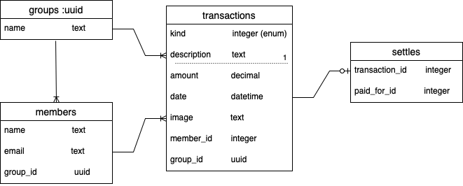
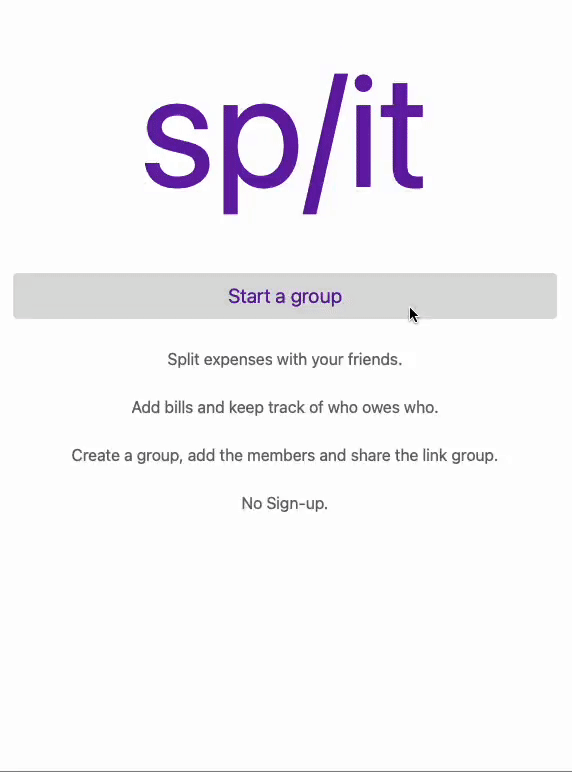

# Split
This application is a split bills.

## Try it on
You can access and use this application at: [Project 3 - Split](https://split-project3.netlify.app).

## Introduction
This was my final project for the General Assembly Software Engineering Immersive boot camp.

It was an excellent opportunity to spend more time in the back end, building the Split logic. I also made a unit test that helped me find a way to solve this problem.

## Project Description
If you (like many other people) are tired of making sign-in / sign-up for every site they want to use, this is the proper application for you. You just have to create a group, add the members and share the link with your friends to start splitting your expenses and keep track of who owes who.

## Usage
* Name a group
* Add some inicial members
* Share the link with the **universally unique identifier** with the members
* Add the expenses you like to share
* And settle up with your friends

## Tech Stack
* React
* Rails API ([GitHub Repo](https://github.com/jaqueelizandro/split-bill_server))
* PostgreSQL
* CSS
* Bootstrap

## Association Models Diagram

## Images

